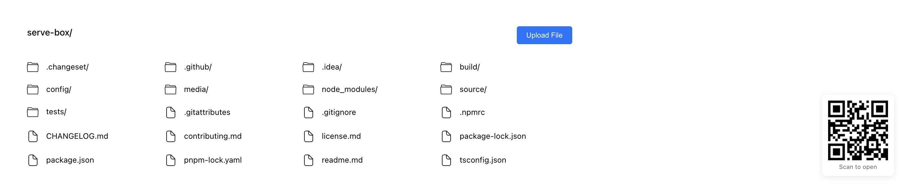

### Serve Box

`serve-box` helps you serve a static site, single page application or just a static file (no matter if on your device or on the local network). It also supports **file uploads**, allowing users to upload files to the server. Additionally, it provides a neat interface for listing the directory's contents:



## Usage

The quickest way to get started is to just run `npx serve-box` in your project's directory.

If you prefer, you can also install the package globally (you'll need at least [Node LTS](https://github.com/nodejs/Release#release-schedule)):

```bash
> npm install --global serve-box
```

Once that's done, you can run this command inside your project's directory...

```bash
> serve-box
```

...or specify which folder you want to serve:

```bash
> serve-box folder-name/
```

Finally, run this command to see a list of all available options:

```bash
> serve-box --help
```

Now you understand how the package works! :tada:

## Features

- **Static file serving**: Serve any static site, SPA, or individual files
- **File uploads**: Upload files directly to the server via the web interface
- **Directory listing**: Browse directory contents with a clean UI
- **Local network sharing**: Easily share files on your local network
- **Authentication**: Authenticate via HTTP basic authentication

## Configuration

To customize `serve-box`'s behavior, create a `serve.json` file in the public folder and insert any of [these properties](https://github.com/vercel/serve-handler#options).

## API

The core of `serve-box` is [`serve-handler`](https://github.com/vercel/serve-handler), which can be used as middleware in existing HTTP servers:

```js
const handler = require('serve-handler');
const http = require('http');

const server = http.createServer((request, response) => {
  // You pass two more arguments for config and middleware
  // More details here: https://github.com/vercel/serve-handler#options
  return handler(request, response);
});

server.listen(3000, () => {
  console.log('Running at http://localhost:3000');
});
```

> You can also replace `http.createServer` with [`micro`](https://github.com/vercel/micro).

## Issues and Contributing

If you want a feature to be added, or wish to report a bug, please open an issue [here](https://github.com/vercel/serve/issues/new).

If you wish to contribute to the project, please read the [contributing guide](contributing.md) first.

## Credits

This project is a fork of [serve](https://github.com/vercel/serve) by Vercel, extended with file upload capabilities.
